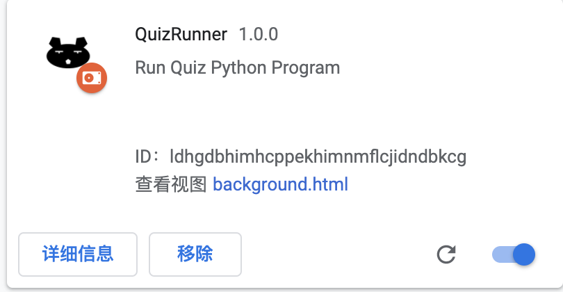

# Web_Python_Runner
#### 利用Chrome插件运行网页上显示的简单Python Code

+ 使用步骤：

  1. 解压extension

     

  2. 进入chrome扩展程序，打开开发者模式（右上角）

     

  3. 点击加载已解压的扩展程序，选中extension导入

     

  4. 出现如下图标后安装成功

     

+ 说明
  + 目前只针对print结果进行输出
  + 可以执行形如">>> "的代码，也即符合quiz格式
  + 请确保格代码格式正确以及符合python3规范并且保证网络连接正常，否则将会报错
